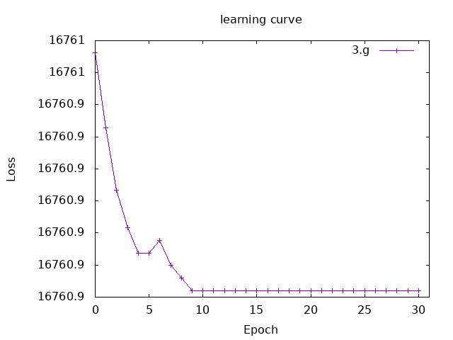

## 3.a-c Train linear regression model from scratch with sample data. 

- **templateの解釈** - :
    ・Tensor型とそれを作る関数、行列積、和、転置行列を作る関数をimportしている。
    ・yとxのTensorリストがある。
    ・linearは次のような関数である。
    　引数１：（Tensor（xとyの２変数ベクトル？）, Tensor（スカラー））
    　引数２：　Tensor（１０変数ベクトル）※xsは15変数あるので15変数ベクトルの方が適切？
    　返り値：　Tensor（１０変数ベクトル）
    　機能：　xの値が羅列されたベクトルを受け取って予測値yを返す。

    mainの中身
    ・xの係数と切片を設定する
    for文の中身
    ・xをTensorにする
    ・linearに係数と切片とxを渡して予測値yを算出する
    ・出力する

    疑問点：for文の中でlinearに渡すxが1*10のベクトルじゃなくてスカラーになってる怪我するけどいいのかな。同様に引数一つめも（Tensor（xとyの２変数ベクトル）, Tensor（スカラー））じゃなくて（スカラ、スカラ）になっちゃってる気がする。
    ->今回は傾きと切片が指定されていると仮定していいから、それを使ってy = a0 + a1 * xで予測値yを算出する！
- **package.yamlの編集** -
    stack runで動かせるように設定を追加した。
- **LinearRegression.hsの編集** -
    linearは estimatedY = sampleA * x + sampleB を計算する関数にした。
    引数１：（Tensor（傾き：スカラー）, Tensor（切片：スカラー））
    引数２：　Tensor（xs：１５変数ベクトル）
    返り値：　Tensor（estimatedY：１５変数ベクトル）
    機能：　xの値が羅列されたベクトルを受け取って予測値yを返す。
    予測値のyと本来のyをTensorからListに変換してzipし、mapM_を使って出力した。
- **コード** -
    import Torch.Tensor (Tensor, asTensor, asValue)
    import Torch.Functional (matmul, add, transpose2D)

    ys :: Tensor
    ys = asTensor ([130, 195, 218, 166, 163, 155, 204, 270, 205, 127, 260, 249, 251, 158, 167] :: [Float])
    xs :: Tensor
    xs = asTensor ([148, 186, 279, 179, 216, 127, 152, 196, 126, 78, 211, 259, 255, 115, 173] :: [Float])

    linear :: 
        (Tensor, Tensor) -> 
        Tensor ->          
        Tensor              
    linear (slope, intercept) input = slope * input + intercept

    main :: IO ()
    main = do
    
    let sampleA = asTensor (0.555 :: Float)
    let sampleB = asTensor (94.585026 :: Float)
    
    linear function with the provided sampleA and sampleB, and print both the correct y and the estimatedY.
    
    let estimatedY = linear (sampleA, sampleB) xs
    
    let ysList = asValue ys :: [Float]
    let estimatedYList = asValue estimatedY :: [Float]
    let result = zip ysList estimatedYList

    mapM_ (\(y, estimatedY) -> do
        print $ "correct answer: " ++ show y
        print $ "estimated: " ++ show estimatedY
        print $ "******"
        ) result    
             
    return ()
- **出力** -
    "correct answer: 130.0"
    "estimated: 176.72504"
    "******"
    "correct answer: 195.0"
    "estimated: 197.81503"
    "******"
    "correct answer: 218.0"
    "estimated: 249.43002"
    "******"
    "correct answer: 166.0"
    "estimated: 193.93002"
    "******"
    "correct answer: 163.0"
    "estimated: 214.46503"
    "******"
    "correct answer: 155.0"
    "estimated: 165.07004"
    "******"
    "correct answer: 204.0"
    "estimated: 178.94504"
    "******"
    "correct answer: 270.0"
    "estimated: 203.36502"
    "******"
    "correct answer: 205.0"
    "estimated: 164.51503"
    "******"
    "correct answer: 127.0"
    "estimated: 137.87503"
    "******"
    "correct answer: 260.0"
    "estimated: 211.69003"
    "******"
    "correct answer: 249.0"
    "estimated: 238.33002"
    "******"
    "correct answer: 251.0"
    "estimated: 236.11005"
    "******"
    "correct answer: 158.0"
    "estimated: 158.41003"
    "******"
    "correct answer: 167.0"
    "estimated: 190.60004"
    "******"

## 3.d Train linear regression model from scratch with sample data.
--**コスト関数について**--
    コスト関数は、y'をyの予測値とすると、次のように表せる。
    cost = (1/n) * sigma[m,i=1] (y'i - yi)^2
--**LinearRegression.hsにcostを実装**--
    引数１：Tensor（y：ベクトル）
    引数２：　Tensor（y'：ベクトル）
    返り値：　Tensor（コスト：スカラー）
    機能：　実測値のyと予測値のyを受け取ってコストを計算する。

    cost ::
    Tensor -> -- ^ grand truth: 1 × 10
    Tensor -> -- ^ estimated values: 1 × 10
    Tensor    -- ^ loss: scalar
    cost z z' = sumAll $ (z - z')^2

## 3.e Train linear regression model from scratch with sample data.
--**数値勾配について**--
    数値勾配とは、その点における傾きのこと。
--**LinearRegression.hsにcalculateNewを実装**--
    引数１：（Tensor（A傾き,B切片：スカラー））
    返り値：　Tensor（勾配：スカラー）
    機能：　受け取ったAorBの値の時の勾配を返す。
    疑問点：　なぜAとBに分かれている？　傾きAに対する数値勾配を計算したいとき、切片Bはどう設定したらいい？
    ->引数を増やして、aとbをもらう関数にする。

    calculateNewA :: 
        Tensor ->
        Tensor ->
        Tensor
    calculateNewA a b = (cost (linear (a+h, b) xs) ys - cost (linear (a, b) xs) ys) / h

    calculateNewB :: 
        Tensor ->
        Tensor ->
        Tensor
    calculateNewB a b = (cost (linear (a, b+h) xs) ys - cost (linear (a, b) xs) ys) / h

## 3.f Train linear regression model from scratch with sample data.
--**考え方**--
    再帰でループさせたい→エポック数を再帰ごとに-1して0以下になったら終了
    一回のループでやること
    ・現在の傾き、切片でのそれぞれの勾配を計算
    ・新しい傾き、切片を学習率に基づいて計算
    ・現在のコストを出力
    ・新しい傾き、切片と-1したエポック数を引数にして再帰
--**実装**--
    関数train
    引数１：Int（epoch数）
    引数２：Tensor（傾き初期値：スカラー）
    引数２：Tensor（切片初期値：スカラー）
    返り値：(Tensor（最適な傾き：スカラー）,Tensor（最適な切片：スカラー）)

    train :: Int -> Tensor -> Tensor -> IO(Tensor, Tensor)
    train 0 a b = do
        let cost_c = cost ys ((linear (a, b)) xs)
        putStrLn $ show(0) ++ " : cost->" ++ show(asValue cost_c :: Float) ++ " a->"  ++ show(asValue a :: Float) ++ " b->"  ++ show(asValue b :: Float)
        putStrLn "学習終了"
        return (a, b)

    train n a b = do
        let cost_c = cost ys ((linear (a, b)) xs)
        putStrLn $ show(n) ++ " : cost->" ++ show(asValue cost_c :: Float) ++ " a->"  ++ show(asValue a :: Float) ++ " b->"  ++ show(asValue b :: Float)

        let newa = a - (rate * (calculateNewA a b))
        let newb = b - (rate * (calculateNewB a b))
        train (n-1) newa newb
--**実行結果**--
    学習率が0.01 ~ 0.000001程度だと購買爆発が起きてしまった。
    これは、初期値の0.555と理想的な値の0.5552の誤差に対して移動する割合が大きすぎるのが原因だと考える。
    0.000001あたりで理想的な数値が出始めたが、0.0000001では変化量が少なかったため、0.0000002で実行したところ望ましい値がでた。
    10 : cost->16760.953 a->0.555 b->94.58503
    9 : cost->16760.941 a->0.55504686 b->94.58503
    8 : cost->16760.932 a->0.5550859 b->94.58502
    7 : cost->16760.926 a->0.55511326 b->94.58502
    6 : cost->16760.922 a->0.5551367 b->94.585014
    5 : cost->16760.922 a->0.5551484 b->94.585014
    4 : cost->16760.924 a->0.55516404 b->94.585014
    3 : cost->16760.92 a->0.5551836 b->94.58502
    2 : cost->16760.918 a->0.55519533 b->94.58502
    1 : cost->16760.916 a->0.55521095 b->94.58502
    0 : cost->16760.916 a->0.55521095 b->94.58502
    学習終了

## 3.g Train linear regression model from scratch with sample data.
--**コード変更**--
    drawLearningCurve がとる引数に、訓練の過程のリストが必要だったので、trainを一部変更し、リストも返すようにした。
--**実行結果**--
    

## 5
--**train**--
    探索終了->18.085972
    a->5.5061683e-2 : b->2.011912e-2 : c->6.297707e-3
--**eval**--
    探索終了->19.395283
    a->1.1593742e-2 : b->4.256295e-3 : c->1.3469319e-3
--**valid**--
    探索終了->18.88134
    a->1.1255843e-2 : b->4.156303e-3 : c->1.3064346e-3

    時間が足りず十分な演習ができなかった。
