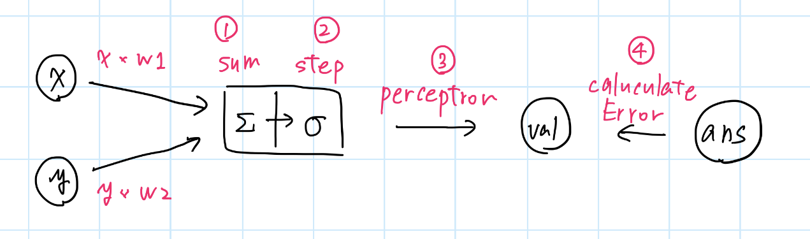
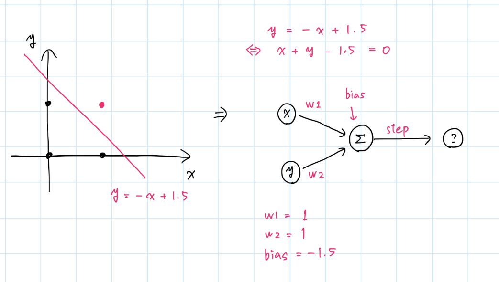

## 1. Build and train an AND gate using a simple perceptron
#### 考えの過程

templateを参考にすると、以下のことが考えられる。

step  
* 引数１：Tensor（スカラー）、（入力値）＊（重み）の合計
* 返り値：Tensor（スカラー）、結果
* 機能：スカラーのTensorを受け取って、正の数は１、それ以外は０を返す関数

percepron  
* 引数１：Tensor（２変数ベクトル）、入力
* 引数２：Tensor（２変数ベクトル）、重み
* 引数３：Tensor（スカラー）、バイアス
* 返り値：Tenor（スカラー）、活性化関数に渡す値
* 機能：(x,y)の入力に対して重みとバイアスを含めて計算して和を取ったものを返す。

caluclateError  
* 引数１：Tensor（スカラー）、stepの結果
* 返り値：Tensor（スカラー）、誤差
* 機能：誤差を計算する関数
* 備考：引数を二つにして、結果と正解を参照して誤差を返す関数にしたほうが良い？

また、[Note](https://medium.com/analytics-vidhya/implementing-perceptron-learning-algorithm-to-solve-and-in-python-903516300b2f)を読んで以下のような流れであることを理解しました。

1. ランダムな重みとバイアス、それから訓練セットを設定する。
2. step関数を定義し、１の重みとバイアスで計算する。
3. calculateError関数で、誤差の合計を計算する。
4. 繰り返しの上限回数と学習率を設定。誤差の合計が０になるか、繰り返し回数が上限に達するまで重みとバイアスの更新を繰り返す。重みの更新は（新しい値）＝（古い値）＋（学習率）*（誤差）＊（関係する入力値）、バイアスの更新は、（新しい値）＝（古い値）+（学習率）＊（誤差）で計算する。


結果は以下のように予測できる。


疑問点：いつ重みを更新している？→各データごと（1エポック毎ではない）

#### 実行結果
```
weight : [0.1321814,2.9640222], bias : -3.095568
Input: [1,1] | Predict: 1.0 | Target: 1 | Score: OK (Before step: 6.3562393e-4)
Input: [1,0] | Predict: 0.0 | Target: 0 | Score: OK (Before step: -2.9633865)
Input: [0,1] | Predict: 0.0 | Target: 0 | Score: OK (Before step: -0.13154578)
Input: [0,0] | Predict: 0.0 | Target: 0 | Score: OK (Before step: -3.095568)
```

