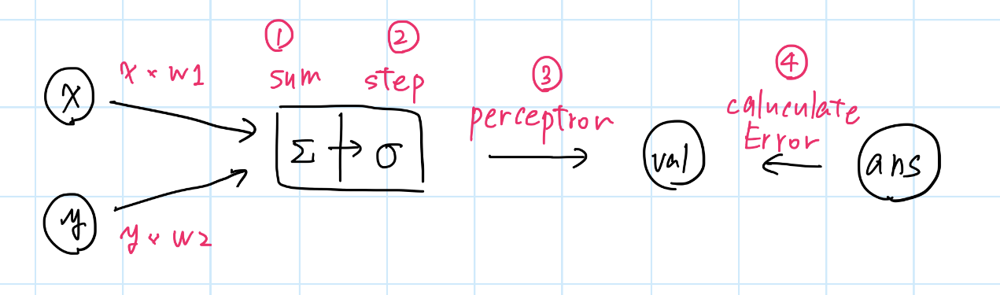
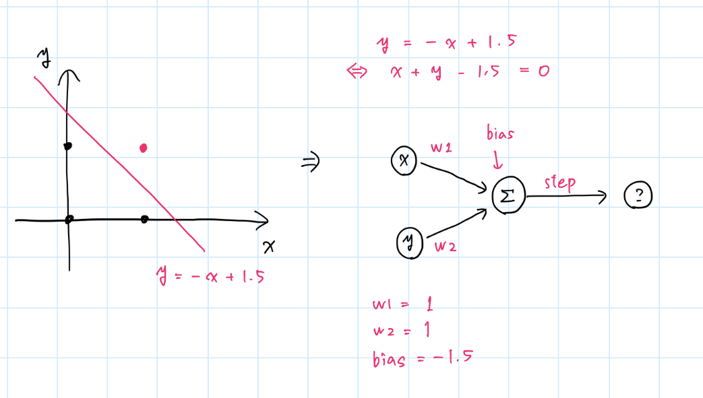
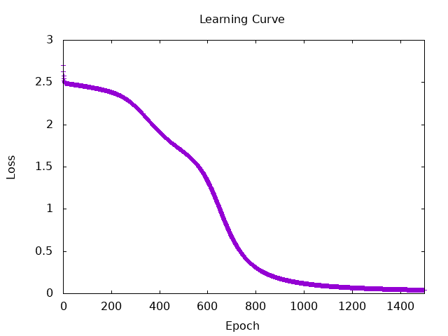

## 1. Build and train an AND gate using a simple perceptron
#### 考えの過程

templateを参考にすると、以下のことが考えられる。

step  
* 引数１：Tensor（スカラー）、（入力値）＊（重み）の合計
* 返り値：Tensor（スカラー）、結果
* 機能：スカラーのTensorを受け取って、正の数は１、それ以外は０を返す関数

percepron  
* 引数１：Tensor（２変数ベクトル）、入力
* 引数２：Tensor（２変数ベクトル）、重み
* 引数３：Tensor（スカラー）、バイアス
* 返り値：Tenor（スカラー）、活性化関数に渡す値
* 機能：(x,y)の入力に対して重みとバイアスを含めて計算して和を取ったものを返す。

caluclateError  
* 引数１：Tensor（スカラー）、stepの結果
* 返り値：Tensor（スカラー）、誤差
* 機能：誤差を計算する関数
* 備考：引数を二つにして、結果と正解を参照して誤差を返す関数にしたほうが良い？

また、[Note](https://medium.com/analytics-vidhya/implementing-perceptron-learning-algorithm-to-solve-and-in-python-903516300b2f)を読んで以下のような流れであることを理解しました。

1. ランダムな重みとバイアス、それから訓練セットを設定する。（Σ（入力値）＊（重み））＋（バイアス）を計算する。
2. step関数にかける。
3. percepron関数で上記を行い、予測値を出す。
4. calculateError関数で、誤差を計算する。
5. 繰り返しの上限回数と学習率を設定。誤差の合計が０になるか、繰り返し回数が上限に達するまで重みとバイアスの更新を繰り返す。重みの更新は（新しい値）＝（古い値）＋（学習率）*（誤差）＊（関係する入力値）、バイアスの更新は、（新しい値）＝（古い値）+（学習率）＊（誤差）で計算する。


結果は以下のように予測できる。


疑問点：いつ重みを更新している？→各データごと（1エポック毎ではない）

#### 実行結果
```
weight : [4.42507,4.7318616], bias : -4.811824
Input: [1,1] | Predict: 1.0 | Target: 1 | Score: OK (Before step: 4.345107)
Input: [1,0] | Predict: 0.0 | Target: 0 | Score: OK (Before step: -0.38675404)
Input: [0,1] | Predict: 0.0 | Target: 0 | Score: OK (Before step: -7.996225e-2)
Input: [0,0] | Predict: 0.0 | Target: 0 | Score: OK (Before step: -4.811824)
```


## 2. Build a XOR gate using a multi-layer perceptron and train it employing the backpropagation mechanism available in the hasktorch library.

### b. Familiarize yourself with the hasktorch implementation, ensuring its alignment with the video's explanation. 
```
data MLPSpec = MLPSpec
  { feature_counts :: [Int],
    nonlinearitySpec :: Tensor -> Tensor
  }
  ```
  多層パーセプトロンの構造  
  feature_counts：それぞれの層に幾つのパラメータを持つか　nonlinearitySpec：活性化関数

  ```
  data MLP = MLP
  { layers :: [Linear],
    nonlinearity :: Tensor -> Tensor
  }
  deriving (Generic, Parameterized)
  ```
> data Linear  
> weight :: Parameter	   
> bias :: Parameter  
  多層パーセプトロンの中身  
  layers：それぞれの層での重みとバイアス　nonlinearity：活性化関数

```
instance Randomizable MLPSpec MLP where
  sample MLPSpec {..} = do
    let layer_sizes = mkLayerSizes feature_counts
    linears <- mapM sample $ map (uncurry LinearSpec) layer_sizes
    return $ MLP {layers = linears, nonlinearity = nonlinearitySpec}
    where
      mkLayerSizes (a : (b : t)) =
        scanl shift (a, b) t
        where
          shift (a, b) c = (b, c)
```
> class Randomizable spec f | spec -> f where  
> sample :: spec -> IO f  
> sample：関数　spec：構造　f：実体　（乱数入りの実体を作る）

>scanl :: (b -> a -> b) -> b -> [a] -> [b]   
>scanl is similar to foldl, but returns a list of successive reduced values from the left:  
>scanl f z [x1, x2, ...] == [z, z `f` x1, (z `f` x1) `f` x2, ...]

>uncurry :: (a -> b -> c) -> (a, b) -> c  
>uncurry converts a curried function to a function on pairs.  
>e.g.  uncurry (+) (1,2) >> 3, map (uncurry max) [(1,2), (3,4), (6,8)] >> [2,4,8]

> data LinearSpec   
> in_features :: Int     
> out_features :: Int  
> in_features：入力数　out_features：出力数

ここで行なっていること：MLPSpecを受け取って、その形の乱数を詰め込んだMLPを返している
mkLayerSizes：リストを受け取って、隣り合った二個ずつのペアのリストを返す関数 e.g. [1,2,3]->[(1,2),(2,3)]  
layer_sizes：（入力数、出力数）のリスト e.g. [（１層目のパラメータ数、２層目のパラメータ数）,（2層目のパラメータ数、3層目のパラメータ数）..]  
linears：layer_sizesをLinearSpec型に変換したもの  
sample：MLPSpecの構造をしたレコードをうけとってMLPを返す関数


```
mlp :: MLP -> Tensor -> Tensor
mlp MLP {..} input = foldl' revApply input $ intersperse nonlinearity $ map linear layers
  where
    revApply x f = f x
```
> intersperse :: a -> [a] -> [a]  
> The intersperse function takes an element and a list and `intersperses' that element between the elements of the list.  
> e.g. intersperse ',' "abcde" >> "a,b,c,d,e"、intersperse 1 [3, 4, 5] >> [3,1,4,1,5]  

> linear :: Linear -> Tensor -> Tensor  
（一層分の（入力値）＊（重み）＋（バイアス）を計算する関数）

引数１：MLP、多層パーセプトロンの中身  
引数２：Tensor（ベクトル）、入力値  
返り値：Tensor（ベクトル）、結果
機能：入力値に対して各層の重みとベクトル、活性化関数を使って計算し結果を返す。


```
batchSize = 2
```
一回のループで使うデータ数

```
numIters = 2000
```
繰り返しの上限回数

```
model :: MLP -> Tensor -> Tensor
model params t = mlp params t
```
引数１：MLP、多層パーセプトロンの中身
引数２：Tensor（ベクトル）、入力値
返り値：Tensor（ベクトル）、結果
機能：入力値に対して各層の重みとベクトル、活性化関数を使って計算し結果を返す。（mlpを使う関数）

```
main :: IO ()
main = do
  init <-
    sample $
      MLPSpec
        { feature_counts = [2, 2, 1],
          nonlinearitySpec = Torch.tanh
        }
```
initに、入力値：２ノード数、中間層：２ノード数、出力値：１ノード数、活性化関数：tanh、それぞれの重みは乱数の多層パーセプトロンを設定する。

```
  trained <- foldLoop init numIters $ \state i -> do
    input <- randIO' [batchSize, 2] >>= return . (toDType Float) . (gt 0.5)
```
> ">>="：Sequentially compose two actions, passing any value produced by the first as an argument to the second. 'as >>= bs' can be understood as the do expression  
> return . (toDType Float) . (gt 0.5)：.は関数合成演算子。右から順に処理される。よって、ここではまず0.5より大きいかを判定し、その結果をFloatに変換し、最後にreturnする。  

traindに繰り返し訓練された重み等(state)が代入される。  
inputはランダムな訓練データ。
```
    let (y, y') = (tensorXOR input, squeezeAll $ model state input)
        loss = mseLoss y y'
```
> squeezeAll :: Tensor -> Tensor  
> サイズが１しかない不要な次元をすべて削ぎ落とす。今回は出力が１なので、Tenosrの一次元ベクトルに圧縮される。  

誤差を計算。
```
    when (i `mod` 100 == 0) $ do
      putStrLn $ "Iteration: " ++ show i ++ " | Loss: " ++ show loss
    (newState, _) <- runStep state optimizer loss 1e-1
    return newState
```
> runStep :: (Parameterized model, Optimizer optimizer) => 
> model -> optimizer -> Tensor -> LearningRate -> IO (model, optimizer)  
> 引数１：model、訓練中のデータ  
> 引数２：optimizer、更新する方法  
> 引数３：Tensor(スカラー)、誤差  
> 引数４：LearningRate 、学習率  
> 返り値：（更新後のデータ、更新の記録）  

stateを、学習率1e-1の勾配降下法で更新する。
```
  putStrLn "Final Model:"
  putStrLn $ "0, 0 => " ++ (show $ squeezeAll $ model trained (asTensor [0, 0 :: Float]))
  putStrLn $ "0, 1 => " ++ (show $ squeezeAll $ model trained (asTensor [0, 1 :: Float]))
  putStrLn $ "1, 0 => " ++ (show $ squeezeAll $ model trained (asTensor [1, 0 :: Float]))
  putStrLn $ "1, 1 => " ++ (show $ squeezeAll $ model trained (asTensor [1, 1 :: Float]))
  return ()
  where
    optimizer = GD
    tensorXOR :: Tensor -> Tensor
    tensorXOR t = (1 - (1 - a) * (1 - b)) * (1 - (a * b))
      where
        a = select 1 0 t
        b = select 1 1 t
```
最終的な値でテストする。

### c. Analyze the differences between this implementation and the hasktorch version. Modify your code for enhanced readability.

```
trainingData :: [([Float],Float)]
trainingData = take 10 $ cycle [([1,1],0),([1,0],1),([0,1],1),([0,0],0)]
```
10個の訓練データを作る。  

```
main :: IO()
main = do
  let iter = 1500::Int
      device = Device CUDA 0
      hypParams = MLPHypParams device 2 [(3,Sigmoid),(1,Sigmoid)]
```
> data MLPHypParams = MLPHypParams {  
> dev :: Device,  
> inputDim :: Int,  
> layerSpecs :: [(Int,ActName)]  
> } deriving (Eq, Show)  
パーセプトロンの構成を形成する。今回は、使用するデバイスはDevice CUDA 0、入力層はノード数２、中間層のノード数３、入力層と中間層の間の活性化関数はシグモイド関数、出力層のノード数は１、中間層と出力層の活性化関数はシグモイド関数のパーセプトロンを構成している。  

```
  initModel <- sample hypParams
```
initModelに、hypParamesの構造を持ち乱数が埋め込まれたものを代入している。  

```
  ((trainedModel,_),losses) <- mapAccumM [1..iter] (initModel,GD) $ \epoc (model,opt) -> do
    let loss = sumTensors $ for trainingData $ \(input,output) ->
                  let y = asTensor'' device output
                      y' = mlpLayer model $ asTensor'' device input
                  in mseLoss y y'
        lossValue = (asValue loss)::Float 
    showLoss 10 epoc lossValue 
    u <- update model opt loss 1e-1
    return (u, lossValue)
```
> mapAccumM :: (Monad m, Foldable t) => t a -> b -> (a -> b -> m (b,c)) -> m (b, [c])  
> mapAccumM xs zero f = do  
>  foldM (\(prev,lst) x -> do  
>                           bc <- f x prev  
>                           return (fst bc, (snd bc):lst)  
>                           ) (zero,[]) xs  
> 機能：状態を更新しながら、毎回の記録も取っておく関数  
> 引数１：畳み込み可能なa、繰り返し回数のリスト  
> 引数２：b、初期値  
> 引数３：(a->b->m (b,c))、関数  

> for：mapの引数をひっくり返した関数  

> asTensor''：Tensor型のデータと、それを格納するデバイスを指定できる関数  

> mlpLayer：パーセプトロンのモデルと入力値を与えて出力値を計算する関数  

> mseLoss：二乗平均誤差を計算する関数  

> sumTensors：１０個の訓練データの二乗平均誤差を合計している  

> showLess：１０回に一回誤差を表示する。  

> update：現在のモデル、更新方法、誤差、学習率を渡して改善したモデルを返す関数  

役割：初期値がinitModel、GD(勾配降下法)でiter回数だけ更新したパーセプトロンのモデルとその時の誤差をtrainModelとlossesに代入している。


```
  drawLearningCurve "graph-xor.png" "Learning Curve" [("",reverse losses)]
```
> drawLearningCurve  
> 引数１：ファイル名
> 引数２：グラフのタイトル
> 引数３：[（名前、データのリスト）]
学習曲線を描画  


```
  forM_ ([[1,1],[1,0],[0,1],[0,0]::[Float]]) $ \input -> do
    putStr $ show $ input
    putStr ": "
    putStrLn $ show ((mlpLayer trainedModel $ asTensor'' device input))
  -- print trainedModel
  where for = flip map
  ```
最終的な学習結果を表示  
```
[1.0,1.0]: Tensor Float []  5.4089e-2
[1.0,0.0]: Tensor Float []  0.9395   
[0.0,1.0]: Tensor Float []  0.9266   
[0.0,0.0]: Tensor Float []  7.2013e-2
```