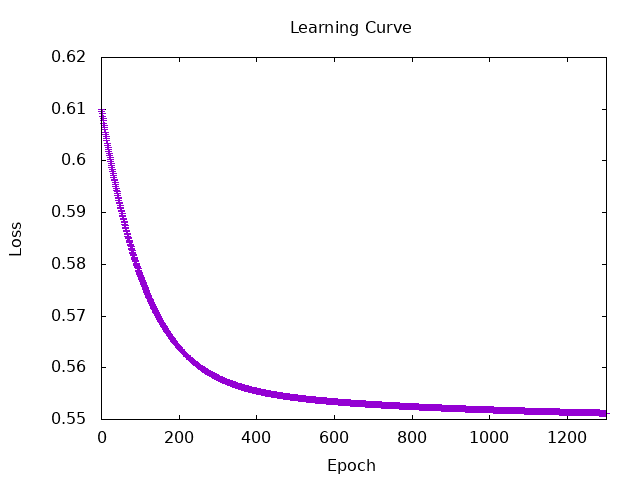
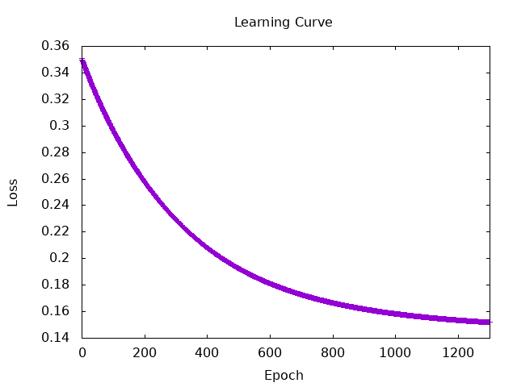

# Hands-on tasks
## 1. Evaluation.hs
+ TP, TN, FP, FN
+ Accuracy  
    (TP + TN) / length
+ Precision
    TP / (TP + FP)
+ Recall
    TP / (TP + FN)
+ Confusion Matrix
    [[TP,TN],[FP,FN]]
+ f1_class1
    2 * Precision * Recall / (Precision + Recall)
+ f1_class0
    Calculated by inverting the labels for Positive and Negative.

・micro-F1 score、 macro-F1 score、 weighted F1-score（to evaluate models with two classes (0 and 1).）

## 2. Admit.hs
Developed a model using CGPA and GREScore as primary features. Based on the previous MlpXor.hs, the following things were imploved:
前回作ったMlpXor.hsをベースにし、以下の点を変更した。
・Loss Calculation：changed from sumTensor to a mean-based approach. 
・Data Standardization：（origin val）ー（mean））/（std）  
・The number of iteration  
・Gradient function  
・Loss function  
・The number of nodes in a MLP  

## 3. Evaluate Ex.2 model.
The model was trained on 400 samples and evaluated on 51 samples. We tested four combinations of activation functions (ReLU, Tanh) and loss functions (MSELoss, BinaryCrossEntropyLoss), running each combinations 10 times to calculate the Mean and Standard Deviation.  
Each graph is at Session5/result_gragh/.

|                               | Mean（Macro F1） | Standard Deviation（Macro F1） | Mean（Weighted F1） | Standard Deviation（Weighted F1） | Mean（Micro F1） | Standard Deviation（Micro F1） |
|-------------------------------|------------------|--------------------------------|---------------------|-----------------------------------|------------------|--------------------------------|
| (Relu,mseLoss)                | 0.8453           | 0.1683                         | 0.8485              | 0.1699                            | 0.8627           | 0.1426                         |
| (Relu,binaryCrossEntropyLoss) | 0.9333           | 0.0543                         | 0.9359              | 0.0506                            | 0.9373           | 0.047                          |
| (Tanh,mseLoss)                | 0.9328           | 0.0219                         | 0.9349              | 0.0211                            | 0.9353           | 0.0208                         |
| (Tanh,binaryCrossEntropyLoss) | 0.9345           | 0.0211                         | 0.9357              | 0.0203                            | 0.9353           | 0.0211                         |

##  4. Make a survey on loss functions such as negative log entropy, cross entropy and KL divergence.
### Negative Log Entropy
Definition：  
$-\log P(x)$  

Use cases：  
Binary classification tasks (e.g., Cat vs. Non-cat).

実行結果：  
Macro F1 : 0.8712121  
Weighted  F1 : 0.87789667  
Micro F1 : 0.88235295  




### Cross Entropy
Definition:  
$H(p,q) = -\sum P(x) \log Q(x)$  
Use cases：  
Multi-class classification.(e.g., Cat vs. Dog vs. Rabbit)

I couldn't execute.

### KL Divergence
Definition:  
$D_{KL}(p||q) = \sum P(x) \log \left( \frac{P(x)}{Q(x)} \right)$  
Use cases：  
Measuring the divergence between the model's predicted distribution and the actual underlying data distribution.

実行結果：  
Macro F1 : 0.96003133  
Weighted  F1 : 0.9609995  
Micro F1 : 0.9607843  


## 5. Titanic.hs

#### Evaluation Results:
```
Macro F1 : 0.77618784
Weighted  F1 : 0.79649377
Micro F1 : 0.79888266
```

Kuggle Public Score：0.76555