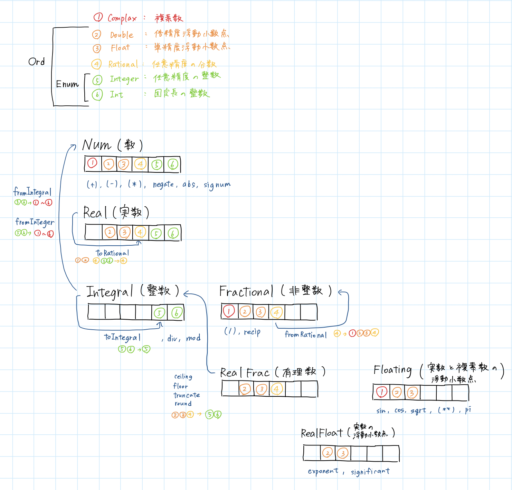

# Understanding the Concepts
## 1. Understand numerical type in Haskell 
次のような図を書いて理解した。  


## 2.Understand accuracy, precision, recall, F1-score, confusion matrix and a variety of averaged F1-score

以下の値を準備する
+ 適合率 (Precision)：
	• 「『正解（陽性）』と予測したもののうち、本当に正解だった割合」
	• 式：TP / (TP + FP)
+ 再現率 (Recall)：
	• 「実際の正解データのうち、正しく正解と予測できた割合」
	• 式：TP / (TP + FN)
+ F1スコア：
	• 適合率と再現率の「いいとこ取り（調和平均）」をした指標。
式：2 * Precision * Recall / (Precision + Recall)

これらの数値を使って一つのデータセットに対して単一のスコアを出す。
+ マクロ平均 (Macro Average)
    やり方：各クラスのF1スコアを単純に足して、クラスの数で割る（算術平均）。
	特徴：データの数に関わらず、すべてのクラスを平等に扱います。
	いつ使う？：データが不均衡（例：飛行機100個、船1個）でも、「数が少ないクラスも同じくらい大事にしたい」時に使います。

+ 加重平均 (Weighted Average)
	やり方：各クラスのデータの数（サポート）に応じて、スコアに重みをつけて平均をとる。
	特徴：データの数が多いクラスのスコアが、全体の結果に強く反映されます。
	いつ使う？：データの不均衡を考慮しつつ、全体としての実力を測りたい時に使います。

+ マイクロ平均 (Micro Average)
	やり方：各クラスの  を全部合計してから、1つのF1スコアの式に当てはめる。
	特徴：個々のデータをすべて平等に扱います。
	マルチクラス分類（1つのデータに1つのラベル）の場合、マイクロ平均F1スコア ＝ 正解率 (Accuracy) になります。
    だから、レポートに「Accuracy」があれば、それがマイクロ平均の結果だと思ってOKです。

# Hands-on tasks
## 1. Evaluation.hs
作成した関数
+ TP, TN, FP, FN
+ Accuracy  
    (TP + TN) / length
+ Precision
    TP / (TP + FP)
+ Recall
    TP / (TP + FN)
+ Confusion Matrix
    [[TP,TN],[FP,FN]]
+ f1_class1
    2 * Precision * Recall / (Precision + Recall)
+ f1_class0
    f1_classのNとPを逆にして算出

・micro-F1 score、 macro-F1 score、 weighted F1-score（１と０の二つのクラスある！）

## 2. Admit.hs
CGPAとGREScoreを特徴量として使用。
前回作ったMlpXor.hsをベースにし、以下の点を変更した。
・lossをsumTensorから平均にする  
・データの値を慣らす（（元の値）ー（平均値））/（標準偏差）  
・繰り返し回数  
・勾配関数  
・損失関数  
・多層パーセプトロンのノード数  

## 3. Evaluate Ex.2 model.
400個のデータで訓練し51個のデータで評価した  
隠れ層の活性化関数（Relu,Tanh）  
損失関数（mseLoss,binaryCrossEntropyLoss）  
四通りで10回ずつ実行し平均と分散を求めた。  
各グラフはSession5/result_gragh/にある。

|                               | Mean（Macro F1） | Standard Deviation（Macro F1） | Mean（Weighted F1） | Standard Deviation（Weighted F1） | Mean（Micro F1） | Standard Deviation（Micro F1） |
|-------------------------------|------------------|--------------------------------|---------------------|-----------------------------------|------------------|--------------------------------|
| (Relu,mseLoss)                | 0.8453           | 0.1683                         | 0.8485              | 0.1699                            | 0.8627           | 0.1426                         |
| (Relu,binaryCrossEntropyLoss) | 0.9333           | 0.0543                         | 0.9359              | 0.0506                            | 0.9373           | 0.047                          |
| (Tanh,mseLoss)                | 0.9328           | 0.0219                         | 0.9349              | 0.0211                            | 0.9353           | 0.0208                         |
| (Tanh,binaryCrossEntropyLoss) | 0.9345           | 0.0211                         | 0.9357              | 0.0203                            | 0.9353           | 0.0211                         |

##  4. Make a survey on loss functions such as negative log entropy, cross entropy and KL divergence.
### Negative Log Entropy
Definition：  
$-\log P(x)$  

Use cases：  
猫かそれ以外かなど、一つのことについて当てはまるか判断したい時。  
正解に対する確信度を最大化したい時。 

実行結果：  
Macro F1 : 0.8712121  
Weighted  F1 : 0.87789667  
Micro F1 : 0.88235295  


### Cross Entropy
Definition:  
$H(p,q) = -\sum P(x) \log Q(x)$  
Use cases：  
猫か犬かうさぎかを判断したい時、結果と訓練データにどれくらい相違があるか知りたい時。  

実行できなかった。

### KL Divergence
Definition:  
$D_{KL}(p||q) = \sum P(x) \log \left( \frac{P(x)}{Q(x)} \right)$  
Use cases：  
AIが作ったモデルと現実のモデルの差異を計りたい時。

実行結果：  
Macro F1 : 0.96003133  
Weighted  F1 : 0.9609995  
Micro F1 : 0.9607843  


## 5. Titanic.hs

#### 実行結果  
```
Macro F1 : 0.77618784
Weighted  F1 : 0.79649377
Micro F1 : 0.79888266
```

Public Score：0.76555

## memo
データは三分割！
（train用とevaluation用しか用意していなかった。グラフは2本(trainとvalid)になるはず！）