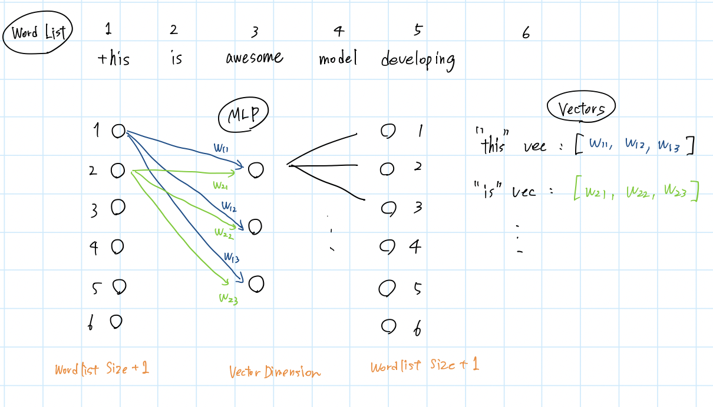
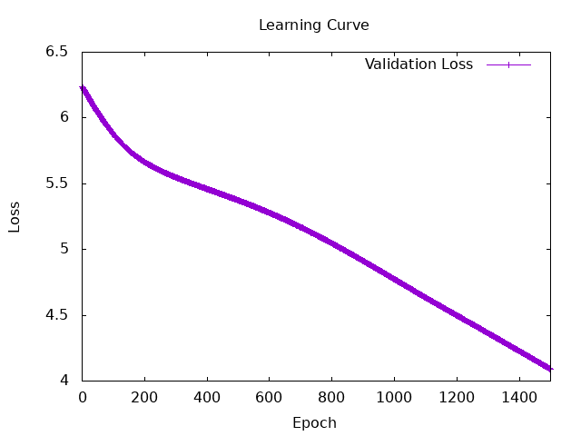
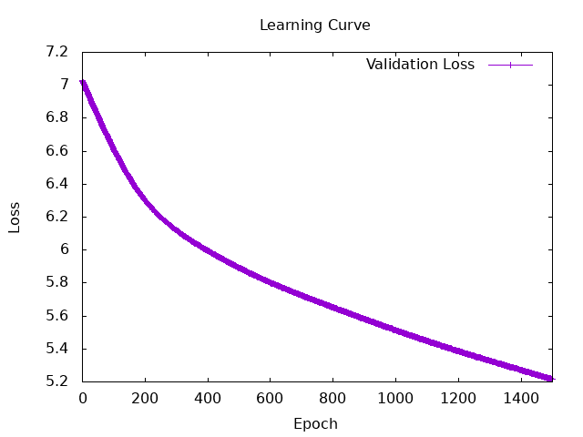
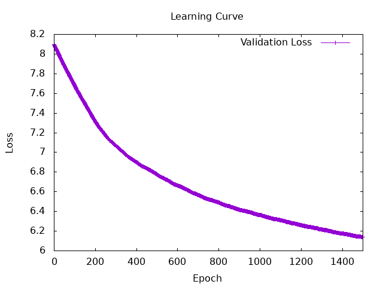
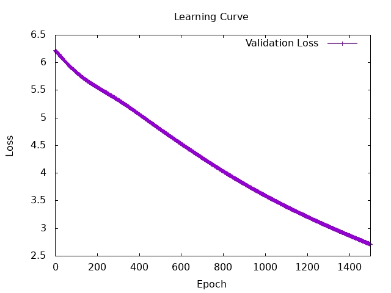
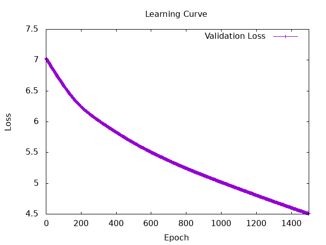
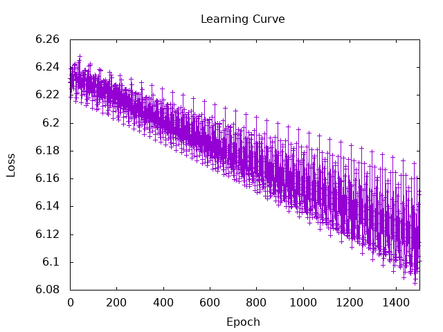

# Understanding the Concepts
## 1. Understand word embeddings using Bag of words
A method to represent text in a machine-readable format.  
+ Why is it necessary?
    + Machines cannot understand words as raw text. Therefore, we convert words into numerical values.  
+ How are words converted into numbers?  
    1. Create a vocabulary dictionary.  
    2. Count the frequency of occurrence for each word.
+ How is it used?
    + Comparing two texts: Checking if similar words appear with similar frequencies.
    + Text classification: Defining "filter words" in advance and classifying texts based on the proportion of these filter words relative to the total word count.
+ Weaknesses
    + Ignores word order: Sentences with different meanings can be judged as identical (e.g., "Taro loves Hanako." is treated the same as "Hanako loves Taro.").
    + Ignores semantic differences: It struggles with words that have multiple contextual meanings within the same text (e.g., in "I do not like movies like this," the word "like" appears twice with different functions).

## 2. Understand word embeddings using word2vec
A method to represent the semantic meaning of words in a machine-readable form.  
+ Why is it necessary?
    + The Bag of Words model simply counts words and completely ignores their meanings. We want to assign a vector to each word so that words with similar meanings or usages have similar vectors.
+ How are the numerical vectors found?  
By using a Neural Network
1. Create an index list of words.
2. Use a training methods described below  to optimize a Multi-Layer Perceptron.
3. Extract the weights of the MLP to use as the word embeddings.
    + Training Methods
        + CBOW : The model takes surrounding words as input and predicts the target word.
        + Skip-gram: The model takes a specific target word as input and predicts the surrounding words.

    
#### Question 1: How many is the typical dimensionality of these vectors?
+ They often have 100 or more dimensions. A higher dimensionality allows the model to capture more complex semantic nuances.
#### Question 2: What is the architecture of the training MLP?
+ Input Layer: Wordlist Size + 1
+ Hidden Layer: Vector Dimension
+ Output Layer: Wordlist Size + 1
+ The weights between the input layer and the hidden layer are extracted as the final word vectors.

#### Question 3: How is the MLP used after training?
+ The goal is not the MLP itself, but the vectors. The objective of training is simply to extract the learned weights.
#### How is Word2Vec used?
+ It is used for finding synonyms, measuring text similarity, and so on.

# Hands-on tasks
## 1. Build bag of words or/and word2vec yourself. 
I trained an MLP using the CBOW architecture. To improve the process, I split the dataset into batches, which saved memory and allowed for a higher number of weight updates. I ran the training multiple times different conditions to compare the results.

Iteration: 1500, Larning rate: 0.5, batchsize: 128

| number | vector dimension | Wordlist size | Final Loss | diff_mean1 | diff_mean2 |
|--------|------------------|---------------|------------|------------|------------|
| 1-4    | 9                | 507           | 4.090603   | 2.03937    | 1.8622047  |
| 2-2    | 9                | 1129          | 5.217930   | 2.1417322  | 1.9370079  |
| 3-1    | 9                | 3269          | 6.137837   | 2.3385828  | 2.2007873  |
| 4-1    | 50               | 507           | 2.712883   | 1.8307086  | 1.7283465  |
| 4-2    | 50               | 1129          | 4.505044   | 1.9448819  | 1.7716535  |
| 4-3    | 50               | 3269          | 5.849594   | 2.1417322  | 1.8582677  |

<details>
<summary>Graphs</summary>







</details>

diff_means is the mean of difference between the actual scores and the predicted values.  
diff_mean1 is caluclated using this conditions.
```
score5 = if sim >= 0.95 then 5.0
                     else if sim >= 0.90 then 4.0
                     else if sim >= 0.85 then 3.0
                     else if sim >= 0.7 then 2.0
                     else if sim >= 0.5 then 1.0
                     else 0.0
 ```

diff_mean2 is caluclated using this conditions.
```
score5 = if sim >= 0.98 then 5.0
                     else if sim >= 0.95 then 4.0
                     else if sim >= 0.85 then 3.0
                     else if sim >= 0.70 then 2.0
                     else if sim >= 0.5 then 1.0
                     else 0.0
```

+ Increasing the vector dimension reduced the loss function. (This is because the amount of information for each word increases.)
+ Expanding the word list increases the cost. (Is it because the model hasn’t fully learned each word?)
+ Tightening the conditions reduces the diff_mean. (I felt it difficult to determine the correct segmentation.)

#### Difficlut points Encountered & Solutions
+ Understanding sample code and trabslating theory to implementation
    + I analyzed the sample code by writing detailed notes directly into the scripts about the functions and usage of each function.
+ Utilizing Embeddings and the MLP effectively
    + Initial Idea: I originally thought I should build an MLP and assign its internal weights to the embeddings, but I couldn't extract the weights properly.
    + Solution: I fetched the vectors of the input words as embeddings, summed them up to create 9-dimensional vectors, and passed them as inputs to the MLP to get the outputs directly. This approach successfully focused the training on the weights between the input and hidden layers, resulting in proper training.
+ Memory constraints preventing sufficient training:
    + Problem: Initially, I used the entire dataset at once per epoch, causing out-of-memory issues.
    + Solution: Following a classmate's advice, I configured a batchsize to split the data. This reduced memory consumption while increasing the frequency of weight updates per epoch.
+ Non-smooth loss curves:
    + Problem: The loss curve was smooth when feeding the entire dataset at once, but it became highly jagged after introducing the batchsize. This happened because I was plotting the raw training loss.
    + Solution(Important): I created a new validation dataset (valid.txt) and plotted the validation loss instead. This successfully yielded a clean, smooth curve.

<details>
<summary>Jagged graph</summary>



</details>

## 2. Make sure you can take a corresponding embedding from a saved embedding by a word.

```
Word: "it" -> index: 9
Embedding Vector: Tensor Float [1,9] [[ 1.0763   , -0.2370   ,  0.6857   ,  0.4365   , -0.2698   , -0.8171   ,  0.1003   ,  0.4028   , -1.0499   ]]
Word: "this" -> index: 27
Embedding Vector: Tensor Float [1,9] [[ 0.6933   ,  1.7339   ,  0.6029   ,  0.5680   , -1.6261   ,  0.5576   ,  0.1117   ,  0.6625   , -0.2912   ]]
```

## 3. Evaluate the trained model using the Semantic Textual Similarity (STS) shared task.
### a. Prepare the data. 
I constructed the dataset by filtering the text so that when each line is tab-separated, and remaining the lines that the first element is a number.

### b. Evaluate how much data the model can predict correctly using the embedding you trained in Ex. 1.
I used Cosine Similarity for evaluation. Since this index whether the directions of the vectors are similar, it is not related to sentence length and measures similarity as a normalized ratio.
+ Question: What is the best way to evaluate this?
    + I calculated the mean difference, but I am unsure if this is the best approach.
+ Question:  The evaluation wasn't good results.
    To find the cause, I exported the individual sentence vectors and their corresponding cosine similarity scores for analysis, but the cause remains unclear. Additionally, while I expected cosine similarity scores to span from -1 to 1, all computed values fell strictly within the 0 to 1 range.

```
Similarity: 5.0 Score: 3.0 Difference: 2.0
0.99999994
Similarity: 3.0 Score: 3.0 Difference: 0.0
0.92684126
Similarity: 3.0 Score: 0.0 Difference: 3.0
0.90746427
Similarity: 3.0 Score: 0.0 Difference: 3.0
0.9351817
Similarity: 3.0 Score: 2.0 Difference: 1.0
0.9315257
Similarity: 3.0 Score: 0.0 Difference: 3.0
0.9127987
...
```


> **Note:** 
> Explanation of the Results

| Exp No. | Epochs | Vector Dim | Batch Size | Vocabulary (wordlist size) | Learning rate | Used Loss Graph | Final Loss | Diff_Mean (Threshold 1) | Diff_Mean (Threshold 2) | Note / Specific Vectors |
| :--- | :---: | :---: | :---: | :---: | :---: | :---: | :---: | :---: | :---: | :--- |
| **1-1** | 300 | 9 | All (507) | Sample 1 (507) | 1.0 | Train |  |  |  | |
| **1-2** | 500 | 9 | All (507) | Sample 1 (507) | 1.0 | Train |  | 1.815 |  | |
| **1-3** | 1500 | 9 | 64 | Sample 1 (507) | 0.5 | Train |  |  |  | |
| **1-4** | 1500 | 9 | 128 | Sample 1 (507) | 0.5 | Valid | 4.091 | 2.039 | 1.862 |`game`, `games` (Sim: -0.621) |
| **2-1** | 150 | 9 | All (1129) | Sample 2 (1129) | 1.0 | Train |  | 2.035 |  | |
| **2-2** | 1500 | 9 | 128 | Sample 2 (1129) | 0.5 | Valid | 5.218 | 2.142 | 1.937 |`game`, `games` (Sim: 0.307) |
| **3-1** | 1500 | 9 | 128 | Sample 3 (3269) | 0.5 | Valid | 6.138 | 2.339 | 2.201 |`game`, `games` (Sim: 0.510) |
| **4-1** | 1500 | 50 | 128 | Sample 1 (507) | 0.5 | Valid | 2.713 | 1.831 | 1.728 |  |
| **4-2** |  | 50 |  | Sample 2 (1129) |  | Valid | 4.505 | 1.945 | 1.772 |  |
| **4-3** |  | 50 |  | Sample 3 (3269) |  | Valid | 5.850 | 2.142 | 1.858 |  |