# Understanding the Concepts
## 1. Understanding the Concepts
A method to improve the accuracy of text analysis by reflecting the results of past inputs in future predictions.

**Why is it necessary? (Compared to BoW and Word2Vec)**
BoW and Word2Vec completely ignore word order or treat words individually. However, when humans actually try to understand a text, we predict the upcoming content based on what we have read so far. An RNN returns predictions based on past word data and new inputs.

**How it works**
When making a prediction, it passes a "hidden state" to the next step. As it reads a word, it receives the hidden state up to the previous point, combines the two, and outputs a prediction along with a new "hidden state."

**Problems and Improvements**
With the above method, if a keyword is far away, the model might have already forgotten it by the time it needs to use it. Therefore, LSTM is used to selectively decide which information to remember and which to forget.

# Hands-on tasks
## Build your RNN model and predict Amazon review scores.
First, to make the `.jsonl` data usable in Haskell, I created a record type and a corresponding function to read it.
I divided the model into an embedding layer, an RNN layer, and an MLP layer.
+ Embedding layer: Converts words into vectors.
+ RNN layer: Reads word vectors from the beginning and updates values as explained in section 1. (This time, I set the hidden state to the same dimensionality as the word vectors).
+ MLP layer: Takes the final hidden state from the RNN layer as input and outputs a scalar value representing the review score.

I built the training process based on the code I wrote in the previous task.

**Running the Model**
Because the original file was too large, I shortened the train and valid data (train: 4,000 lines, valid: 500 lines).
I updated the weights using the train data and drew the learning curve using the valid data.
Initially, the learning curve was jagged, but I found that making the learning rate smaller smoothed it out.

The learning graph(300 iterations,a learning rate of 0.01,a batch size of 64)

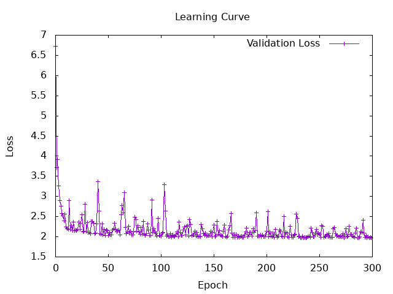

The conditions were: 1,000 iterations, a learning rate of 0.0001, a batch size of 16, and a vocabulary size of 3,269 words.

**Execution Results**
| Initialization Strategy | run 4-1 | run 4-2 | run 4-3 | run 4-4 | run 4-5 | Mean Accuracy | Variance |
| :--- | :---: | :---: | :---: | :---: | :---: | :---: | :---: |
| Pre-trained (emb4) | 13.55% | 14.10% | 9.62% | 14.77% | 14.49% | 13.31% | 4.455 |
| Random (rand4) | 17.42% | 13.29% | 13.55% | 17.08% | 12.46% | 14.76% | 5.343 |

The learning graphs

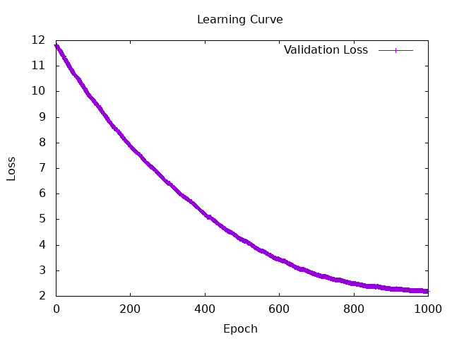
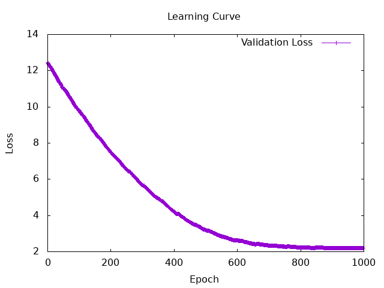
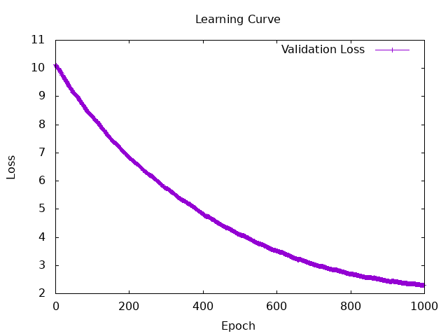
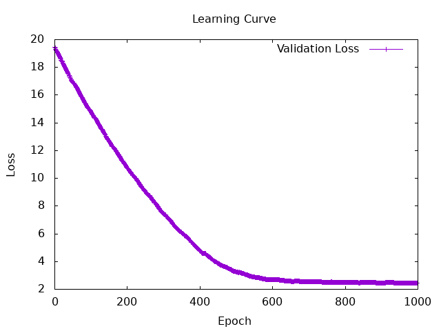
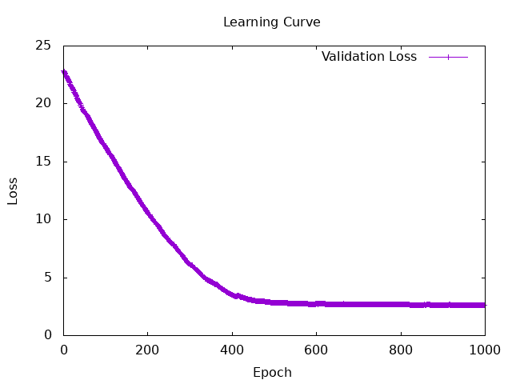

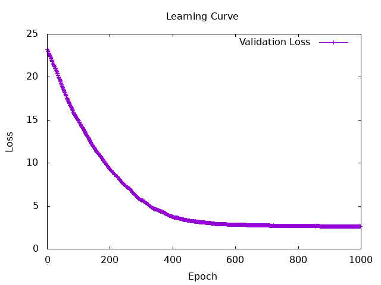
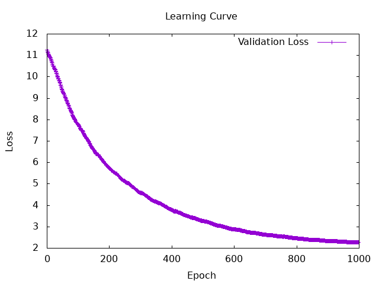
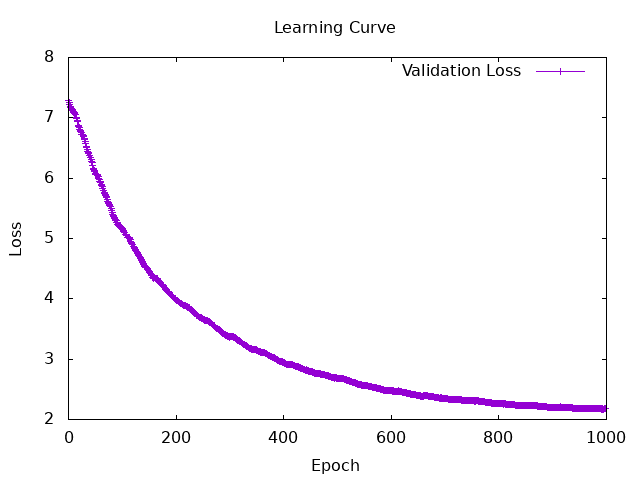
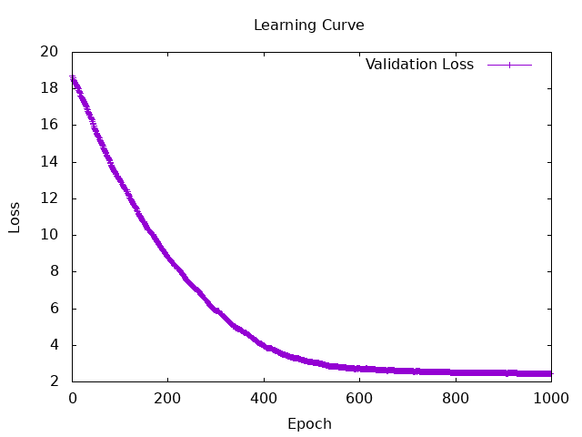
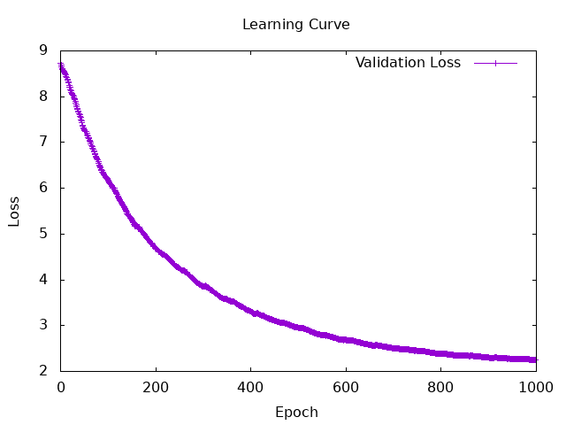

+ Even when using embeddings as the initial values, the results didn't particularly improve. I thought the initial values of the learning curves would be roughly the same, but they also varied.
+ Using random values drew a smoother learning curve, while using embeddings resulted in a graph where the slope suddenly changed at a certain point.
+ As expected, the variance was smaller when using embeddings.
+ Another possible reason for the low accuracy is that the text contains many words not found in the vocabulary.

**Discussion**
+ Was it not very good because the values were trained using CBOW?
+ The predicted values ended up almost entirely being 4 -> The model was trained to take the overall average value.
+ The RNN and MLP are affected by this because their initial values are random.