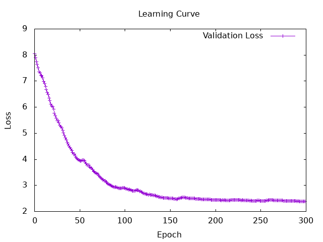

## Creation of a New Vocabulary Dictionary
An attempt was made to improve the self-built embedding, but due to a lack of memory, it was decided to use an existing pre-trained model.
300-dimensional word vector data was obtained and introduced from the [GloVe](https://nlp.stanford.edu/projects/glove/) website.
Since the data size was too large, not all of it was used; instead, the top 10,000 most frequent words were extracted and used.
Additionally, to handle out-of-vocabulary (OOV) words, a process was implemented to append one zero vector to the end of the embedding.

## Increasing the Number of Dimensions
Along with the introduction of the new vocabulary dictionary, the number of dimensions of the word vectors was increased to 300.
Furthermore, to enhance the expressiveness of the model, the number of dimensions of the RNN's hidden state was set to 256.
However, due to memory constraints, the number of training repetitions (iterations) was set to 300.

## Improvement of the Evaluation Method
To understand the model's performance in more detail, the evaluation metrics were improved as follows:
+ Added the measurement of accuracy, F1 score, and out+of-vocabulary (OOV) rate.
+ Changed to display a Confusion Matrix to visualize t+e bias in the prediction results.

## Results
Conditions:  
 + Number of iterations: 300
 + Learning rate: 0.0001
 + Batch size: 16
 + Number of word vector dimensions: 300
 + Hidden state layer: 256  



```
===== 評価結果 =====
【正解率 (Accuracy)】: 13.0199995 %
【Macro F1スコア】   : 8.095141e-2
【Weighted F1スコア】: 4.7293276e-2
【未知語率】  : 20723 / 228241 (9.079437 %)
【未知語彙率】  : 5824 / 10000 (58.24 %)

【Confusion Matrix】
      予測1 予測2 予測3 予測4 予測5
正解1: [0,169,156,1184,0]
正解2: [0,55,74,375,0]
正解3: [0,88,77,696,0]
正解4: [0,179,101,1170,0]
正解5: [1,775,375,4525,0]
```

+ Predicted values almost never became "1" or "5," and the results were extremely biased, with the large majority falling into "4."
+ Accuracy still remains low.
+ The F1 score, which indicates the balance between precision and recall, also showed very low values.
+ On the other hand, due to the improvement in preprocessing, the OOV rate decreased to 9%, showing a significant improvement. Although the OOV vocabulary rate itself is still high, it is inferred that these are words with low frequency of occurrence.

## Discussion
Last time, a hypothesis was formed that predictions might bias toward "4" because "4" is close to the average value of the entire data.
This time, although the foundational reading comprehension improved by increasing the number of dimensions and improving the initial values of the embedding, the accuracy still remained low.

The fundamental cause of this is considered to be the use of `mseLoss` (Mean Squared Error) as the loss function. Since `mseLoss` evaluates errors by squaring them, the penalty becomes extremely large when making an extreme prediction (such as 1 or 5) and missing by a wide margin. Therefore, it is highly possible that the model learned to output a "safe average value (around 4)" in an attempt to minimize the penalty. In this task setting, it is inferred that `mseLoss` is not appropriate.

By next time, I would like to change the task from regression to multi-class classification, and compare and verify the results using `nllLoss` (Negative Log-Likelihood Loss) as the loss function.